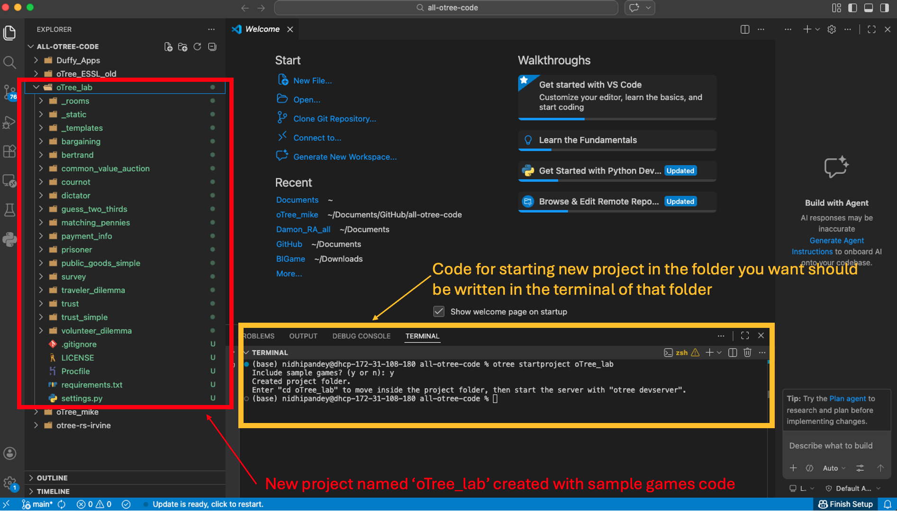

# Getting Started: VS Code, Projects, and Apps 

This part covers the core terminal commands you will use every time
you work in oTree. By the end of this part, you will be able to
create a new oTree project and app from scratch, run the development
server, and navigate your project folder in VS Code.

## Opening VS Code and navigating to the right folder

Before creating an oTree project, decide where on your computer
you want to store your work. A good habit is to keep all your
oTree projects inside a dedicated folder — for example, a folder
called `oTree_lab` inside your Documents folder.

To open that folder in VS Code:

1. Open VS Code
2. Click **File** → **Open Folder**
3. Navigate to your chosen folder and click **Open**

You should now see the folder listed in the Explorer panel on
the left side of the screen.

## Opening the terminal in VS Code

Almost everything in oTree is done through the terminal. In VS Code,
open a terminal by clicking **Terminal** → **New Terminal** from
the top menu bar. A terminal panel will appear at the bottom of
the screen.

::: {.callout-note}
## What is the terminal?
The terminal is a text-based interface where you type commands
directly to your computer. You will use it constantly in oTree —
to navigate between folders, create projects and apps, and run
the server.
:::

## Navigating folders: `cd`

The terminal always has a "current directory" — the folder it is
currently pointed at. Before running any oTree commands, make sure
the terminal is pointed at the right place.

The command `cd` (short for "change directory") is how you move
around.

**Navigate into a folder:**

```bash
cd Documents/oTree_lab
```

**Go back to your home directory:**

```bash
cd ~
```

::: {.callout-warning}
## Avoid spaces in folder names
If any folder in your path has a space in its name, wrap the
entire path in quotes:

```bash
cd "Documents/my projects/oTree_lab"
```

The safest habit is to never use spaces in folder or file names
at all — use underscores instead (e.g., `oTree_lab`).
:::

## Finding your working directory: `pwd`

Before running any oTree command, you need to know exactly where
the terminal is pointed. The command `pwd` (print working directory)
tells you the full path of your current location.

```bash
pwd
```

You will see output like this:

```bash
/Users/nidhipandey/Documents/GitHub/all-otree-code
```

This is the single most useful command for diagnosing navigation
errors. If a `cd` command fails with "no such file or directory,"
run `pwd` first to confirm where you actually are before trying
again.

::: {.callout-warning}
## The Explorer panel and the terminal are not always in sync
The VS Code Explorer panel shows the folder you have **open in
VS Code**. The terminal shows the folder it is **currently
pointed at**. These are two separate things and they can
easily get out of sync — especially if you open the terminal
from a different location or run `cd ~` and navigate elsewhere.

Always check `pwd` if the terminal and the Explorer panel seem
to be showing different things.
:::

## Navigating to a folder using the VS Code terminal

The safest and most reliable way to make sure the terminal is
pointed at the right folder is to let VS Code do it for you.

**The recommended workflow:**

1. Open VS Code
2. Click **File** → **Open Folder** and select the folder you
want to work in — for example, `all-otree-code`
3. Click **Terminal** → **New Terminal**

VS Code will automatically open the terminal pointed at the
folder you have open in the Explorer panel. You will see the
folder name in the terminal prompt confirming this.

From there, if you want to navigate into a subfolder — for
example `oTree_lab` — just run:

```bash
cd oTree_lab
```

This works every time because the terminal is already inside
the parent folder. You do not need to type out the full path.

::: {.callout-important}
## Always open a new terminal from inside VS Code
If you open a terminal from outside VS Code — for example
from macOS Spotlight or the Applications folder — it will
start pointed at your home directory `~`, not at your project
folder. You will then have to navigate manually using the full
path, which is easy to get wrong.

The habit to build: **open VS Code first, open the right
folder, then open the terminal from inside VS Code.**
:::

::: {.callout-tip}
## When `cd` says "no such file or directory"
This error does not always mean the folder does not exist. It
usually means the terminal cannot see it from its current
location. Run `pwd` to check where you are, then build the
correct path from there. For example, if `pwd` returns
`/Users/yourname/Documents/GitHub/all-otree-code`, then a
folder called `oTree_lab` inside it is reachable with:

```bash
cd oTree_lab
```

But a folder somewhere else entirely on your computer will
not be reachable with just its name. You must navigate to
its parent folder first, or use the full path:

```bash
cd /Users/yourname/Documents/GitHub/all-otree-code/oTree_lab
```
:::

## Starting a new oTree project: `otree startproject`

::: {.callout-important}
## Project vs. App — know the difference
An oTree **project** is the top-level container for your
experiment. It holds the `settings.py` file and all of your apps.
You will typically only create one project per course or research
project. This is a rare task; most of the times you would be creating
new apps within an existing project.

An oTree **app** is a single task or module within your experiment
(e.g., a survey, a game, a payment screen). You will create new
apps regularly.

Make sure you know which one you need before running a command.
:::

Navigate to your desired folder in the terminal, then run:

```bash
otree startproject PROJECT_NAME
```

Replace `PROJECT_NAME` with a name of your choice — no spaces or
special characters. For example:

```bash
otree startproject oTree_lab
```

oTree will ask whether you want sample games included:

```bash
Include sample games? (y or n):
```

Type `y` and press Enter. This is useful for your first project
as it gives you working examples to explore.

Once the project is created, navigate into it:

```bash
cd oTree_lab
```

### What just got created?

Click on the image below to see what the oTree project folder that you created looks like.

```{r}
#| label: fig-vscode-startproject
#| echo: false
#| fig-cap: |
#|   VS Code after running `otree startproject oTree_lab`. The Explorer
#|   panel (left) shows the newly created project folder containing the
#|   `settings.py` file and all sample app folders. The terminal at the
#|   bottom shows the full sequence of commands run to create and navigate
#|   into the project. Note: the code for starting a new project should
#|   be written in the terminal of the folder you want the project to live in.


```

Open the Explorer panel in VS Code and look at your new project
folder. Here are the key things to know:

| Item | What it is |
|------|------------|
| `settings.py` | The control center for the entire project. You will edit this regularly. |
| `_rooms/` | Where room configuration files go. Do not touch unless instructed. |
| `_static/` | Where shared static files (images, CSS, JS) go. |
| `_templates/` | Where shared HTML templates go. |
| Sample app folders | The sample games oTree installed for you. |

## Starting a new app: `otree startapp`

Make sure your terminal is pointed at your project folder, then
run:

```bash
otree startapp APP_NAME
```

For example:

```bash
otree startapp my_survey
```

This creates a new folder called `my_survey` inside your project.
Inside it you will find:

- `__init__.py` — the Python file where all the logic for your
app lives
- No HTML files yet — you will create those yourself as you
build out your pages

::: {.callout-tip}
## Name your apps carefully
App names become part of the URL that participants see during
your experiment. Use short, lowercase names with underscores and
no special characters. Avoid names that reveal anything about
your experimental design (e.g., do not call an app
`treatment_group`).
:::

## Running the server: `otree devserver`

To preview your project in the browser, run:

```bash
otree devserver
```

You will see output like this in the terminal:

```bash
Open your browser to http://localhost:8000/
To quit the server, press Control+C.
```

Open your browser and go to `http://localhost:8000/demo` to see
the oTree Demo page. All the sample games will be listed there.
Click on any one to try it out.

::: {.callout-warning}
## Always quit the server when you are done
When you are finished, go back to the terminal and press
**Ctrl + C** to stop the server. Do not just close the browser
window — always quit the server first.
:::

## Resetting the database: `otree resetdb`

Whenever you make changes to model variables in your app or
update `settings.py`, you need to reset the database before
running the server again:

```bash
otree resetdb
```

oTree will ask you to confirm:

```bash
This will delete and recreate your database.
Proceed? (y or n): y
```

::: {.callout-important}
## Do not reset if you have real session data
Resetting the database permanently deletes all session data.
If you have collected data from real participants, download it
**before** running `otree resetdb`. You cannot recover it
afterward.
:::

## Zipping your project: `otree zip`

The `otree zip` command packages your entire oTree project into a
single `.otreezip` file. This is useful for sharing your project
with collaborators, submitting it for a class, or uploading it
to a server for deployment.

Make sure your terminal is pointed at your project folder, then
run:

```bash
otree zip
```

oTree will create a file called `PROJECT_NAME.otreezip` in the
same folder. For example, if your project is called
`my_experiment`, the output will be:

```bash
Created my_experiment.otreezip
```

You can share this file directly with anyone who has oTree
installed. To unzip and run it, they simply run:

```bash
otree unzip my_experiment.otreezip
```

::: {.callout-tip}
## When to zip
Zip your project whenever you want to share it or submit it.
It is also a good habit to zip and save a copy of your project
before making major changes — think of it as a quick manual
backup.
:::

## Summary of terminal commands

| Command | What it does |
|---------|--------------|
| `pwd` | Print the full path of your current directory |
| `cd FOLDER_NAME` | Navigate into a folder |
| `cd ~` | Return to your home directory |
| `otree startproject NAME` | Create a new oTree project |
| `otree startapp NAME` | Create a new app inside a project |
| `otree devserver` | Start the local development server |
| `otree resetdb` | Reset the database |
| `otree zip` | Package the project into a `.otreezip` file |
| `otree unzip FILE.otreezip` | Unpack a zipped project |
| `Ctrl + C` | Stop the server |