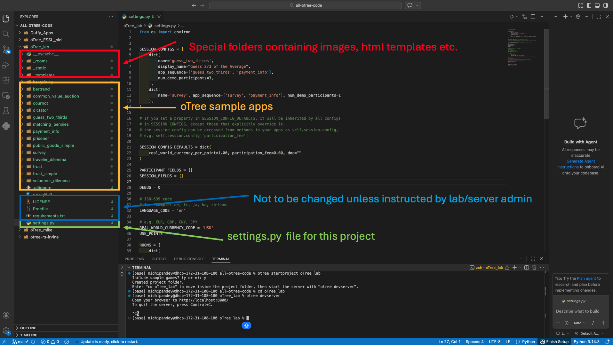
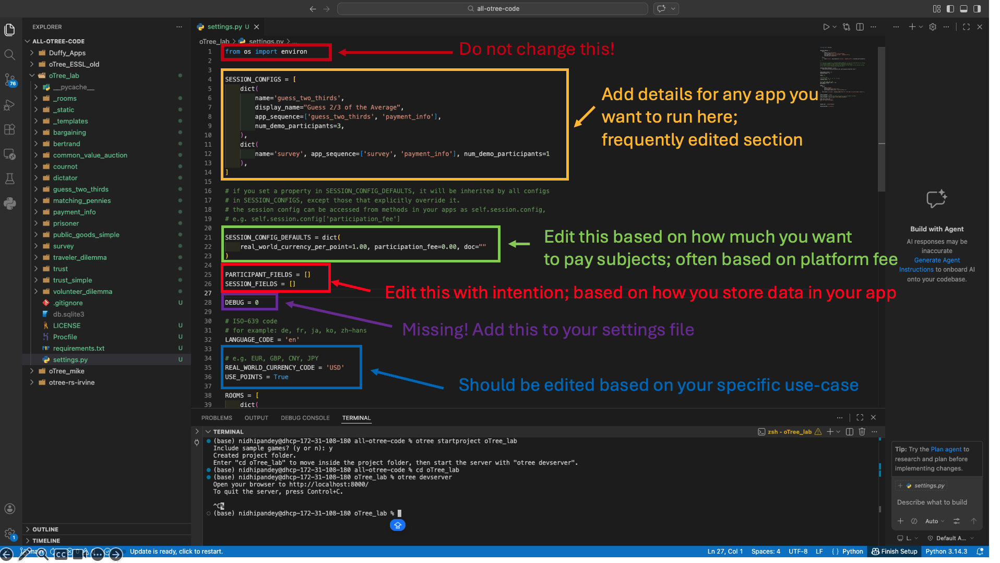
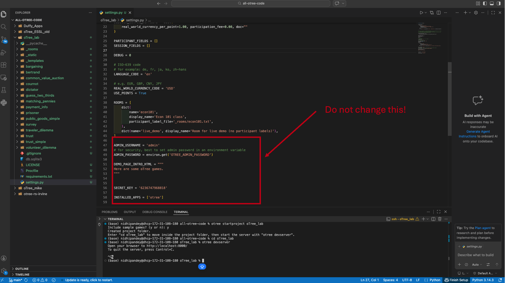

# Inside an oTree Project: Folder Structure and `settings.py`

Now that you have created your first oTree project, it is time to
understand what is actually inside it. Every decision about how your
experiment runs — which apps are included, how many participants can
demo it, what the payment structure looks like — flows through one
file: `settings.py`. This part explains the project folder layout and
walks through the key components of `settings.py` so you know what to
edit, what to leave alone, and why.

## The oTree project folder

When you run `otree startproject` and include sample games, oTree
generates a ready-to-use project folder. Click on the image below to
see what that looks like in VS Code.

```{r}
#| label: fig-project-folder
#| echo: false
#| fig-cap: |
#|   The oTree project folder `oTree_lab` open in VS Code. The Explorer
#|   panel shows the full contents of the project: the special system
#|   folders (`_rooms`, `_static`, `_templates`), the pre-installed
#|   sample app folders (such as `bargaining`, `prisoner`, `survey`, and
#|   others), and the `settings.py` file at the bottom of the list. The
#|   terminal confirms that the project was created and the working
#|   directory is now inside `oTree_lab`.


```

Here is a breakdown of every item you will see in a new oTree project:

| Item | What it is | Do you edit it? |
|------|-----------|----------------|
| `settings.py` | The control center for the entire project | Yes — regularly |
| `_rooms/` | Stores room configuration files for live sessions | Only when instructed |
| `_static/` | Shared static files (images, CSS, JS) used across apps | As needed |
| `_templates/` | Shared HTML templates used across apps | As needed |
| App folders (e.g., `survey/`) | Each folder is one oTree app | Yes — this is where you build |
| `requirements.txt` | Lists Python packages the project depends on | Rarely |
| `Procfile` | Server configuration file | Do not touch |
| `LICENSE` | License file | Do not touch |

::: {.callout-warning}
## Special folders vs. app folders
The three folders that begin with an underscore — `_rooms/`, `_static/`,
and `_templates/` — are system folders, not apps. Do not confuse them
with your app folders. Never delete or rename them unless instructed by
your lab administrator.
:::

## The `settings.py` file

The `settings.py` file is the control center for your entire oTree
project. Every app you want to run, every payment parameter, and every
session configuration lives here. You will edit this file regularly
throughout the course.

Click on the image below to see what a typical `settings.py` file
looks like.

```{r}
#| label: fig-settings-py-1
#| echo: false
#| fig-cap: |
#|   The `settings.py` file for an oTree project open in VS Code. The
#|   file contains several distinct sections: `SESSION_CONFIGS` (edited
#|   regularly), `SESSION_CONFIG_DEFAULTS` (edit with intention as needed),
#|   `PARTICIPANT_FIELDS` and `SESSION_FIELDS` (edited with intention as
#|   needed), and system-level settings such as `SECRET_KEY` and
#|   `INSTALLED_APPS` (never touch these). Each section serves a
#|   different purpose in controlling how your experiment runs.


```

### `SESSION_CONFIGS`: Your session list

`SESSION_CONFIGS` is a Python list of dictionaries. Each dictionary
defines one session — one experiment you can run or demo from the
admin interface. Think of it as the menu of sessions available in
your project.

Here is what a `SESSION_CONFIGS` list looks like:

```python
SESSION_CONFIGS = [
    dict(
        name='guess_two_thirds',
        display_name="Guess 2/3 of the Average",
        app_sequence=['guess_two_thirds', 'payment_info'],
        num_demo_participants=3,
    ),
    dict(
        name='survey',
        app_sequence=['survey', 'payment_info'],
        num_demo_participants=1,
    ),
]
```

Every session dictionary requires three key-value pairs:

| Key | What it does |
|-----|-------------|
| `name` | A unique internal identifier for the session. No spaces or special characters. |
| `app_sequence` | A Python list of app names in the order participants will complete them. |
| `num_demo_participants` | How many participants are created when you run a demo of this session. |

::: {.callout-tip}
## Choosing `num_demo_participants`
Set this number based on your experimental design. If an app groups
participants in pairs, use a multiple of 2. If it groups them in
threes, use a multiple of 3. For individual decision-making tasks,
1 is enough to test the app.
:::

You can also include optional keys in any session dictionary:

| Optional key | What it does |
|-------------|-------------|
| `display_name` | The name shown in the admin interface. If omitted, `name` is used. |
| `real_world_currency_per_point` | Overrides the default exchange rate for this session only. |
| `participation_fee` | Overrides the default participation fee for this session only. |

### `SESSION_CONFIG_DEFAULTS`: Project-wide defaults

`SESSION_CONFIG_DEFAULTS` is a single dictionary that sets default
values inherited by all sessions unless a session dictionary explicitly
overrides them. The two most commonly used defaults are
`real_world_currency_per_point` and `participation_fee`.

```python
SESSION_CONFIG_DEFAULTS = dict(
    real_world_currency_per_point=1.00,
    participation_fee=10.00,
    doc=""
)
```

If you want one specific session to use a different exchange rate or
participation fee, simply add that key to that session's dictionary
in `SESSION_CONFIGS` and it will override the default for that session
only.

::: {.callout-important}
## Lab participation fees
If you run sessions through the ESSL lab, you are bound by the lab's
participation fee policy. Make sure the `participation_fee` in your
settings reflects the approved rate before running any real sessions.
:::

### `PARTICIPANT_FIELDS` and `SESSION_FIELDS`

These two settings are lists that become relevant in more advanced
experiments where you need to carry data from one app to the next —
for example, storing a participant's treatment assignment in the first
app and reading it back in the payment screen.

- Use `PARTICIPANT_FIELDS` for data that is specific to an individual
participant (e.g., their assigned treatment condition).
- Use `SESSION_FIELDS` for data that applies equally to everyone in
the session.

For now, you can leave these as empty lists:

```python
PARTICIPANT_FIELDS = []
SESSION_FIELDS = []
```

You will learn how to use them properly in later sessions when your
experiments involve multiple apps.

### `DEBUG`

You do not currently have this in your settings.py file. Add DEBUG = 0 to your file settings.py under `SESSION_FIELDS`:

```python
PARTICIPANT_FIELDS = []
SESSION_FIELDS = []

DEBUG = 0
```
**What `DEBUG` does**

`DEBUG` controls whether oTree runs in development mode or production mode.

| Value | Mode | What it means |
|-------|------|---------------|
| `DEBUG = 1` | Development mode | Extra tools and error information are turned on |
| `DEBUG = 0` | Production mode | Clean participant-facing interface, no extra tools |

**Why `DEBUG = 1` is useful when building your app**

When you are writing and testing your code, setting `DEBUG = 1` gives
you two very useful advantages:

1. **Auto-advance buttons** — On every page, oTree adds a small button
that lets you skip past that page without manually filling in any form fields
 — pages are submitted with empty or default values instead.
This lets you click through the entire experiment in seconds to check
that the page flow works correctly, without having to fill in every
input every time.

2. **Detailed error messages** — If your Python code crashes, oTree
shows you a full error traceback directly in the browser instead of
just a blank page. This makes it much faster to find and fix problems
in your code.

These two features make the development cycle dramatically faster.
Instead of filling in every form field on every page just to check
one thing at the end of the experiment, you can click through the
whole app in a few seconds.

**Why you must switch to `DEBUG = 0` before running real sessions**

When `DEBUG = 1`, participants can also see the auto-advance buttons
and skip past pages without submitting their answers. This means your
data will be incomplete or entirely missing. Always confirm that
`DEBUG = 0` before inviting any real participants.

::: {.callout-warning}
## Do not run real sessions with `DEBUG = 1`
If `DEBUG = 1` is on during a live session, 
participants will see a skip button on every page 
that lets them bypass your forms — 
if they use it, their answers will not be recorded. 
Always confirm `DEBUG = 0` before starting
any real data collection.
:::

::: {.callout-tip}
## A useful development habit
While building and testing your app: set `DEBUG = 1`.
Before running any real session: set `DEBUG = 0`.
This single switch is one of the most common sources of data
collection errors for new oTree users — do not forget it.
:::

### What you should never touch

Some parts of `settings.py` must not be modified under any
circumstances:

| Setting | Why you leave it alone |
|---------|----------------------|
| `from os import environ` | System import required by oTree — removing it breaks the project |
| `SECRET_KEY` | Security key for the project — changing it will break everything |
| `INSTALLED_APPS` | Registers oTree with Django — do not modify |
| `ADMIN_PASSWORD` | Managed via environment variables by your administrator |

```{r}
#| label: fig-settings-py-2
#| echo: false
#| fig-cap: |
#|   The end of the `settings.py` file for an oTree project open in VS Code. 
#|   Do not change system-level settings such as `SECRET_KEY` and
#|   `INSTALLED_APPS`. Each section serves a
#|   different purpose in controlling how your experiment runs.


```


::: {.callout-warning}
## When in doubt, do not touch it
If a line in `settings.py` is not covered in this guide, leave it
exactly as it is. Only edit the parts you understand. When in doubt,
ask before making any changes.
:::

## Summary

| Section | What it controls | How often you edit it |
|---------|-----------------|----------------------|
| `SESSION_CONFIGS` | Which sessions and apps are available | Regularly |
| `SESSION_CONFIG_DEFAULTS` | Default payment and session parameters | Occasionally |
| `PARTICIPANT_FIELDS` | Cross-app participant-level data | When needed |
| `SESSION_FIELDS` | Cross-app session-level data | When needed |
| `USE_POINTS` |If `True`, earnings are shown in points and converted using the exchange rate. If `False`, real currency is used directly | When needed — based on your design |
| `DEBUG` | `0` = production mode (normal). `1` = debug mode (shows extra info on participant pages) | Leave at `0` unless developing app or troubleshooting |
| System settings | Security, server configuration | Never |